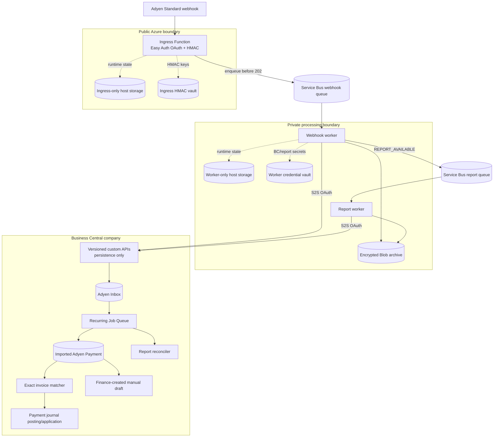

# Architecture and information flow

## Deployment boundary

## Event processing

1. App Service Authentication validates the OAuth access token supplied by Adyen.
2. The ingress reads at most the configured request size, verifies every item's Adyen HMAC with the current or previous key, and checks merchant and test/live environment.
3. It hashes the exact received request and creates each transport ID from that hash plus the notification-item position. It enqueues the raw envelope and returns `202` only after Service Bus accepts every item.
4. The worker archives the exact request body, converts minor units to an exact major-unit decimal, and posts the v1 inbound contract to Business Central.
5. The Business Central API validates the one-to-one merchant/environment mapping and inserts the inbox record. It does no matching or posting.
6. The Job Queue processes at most 50 messages per invocation, committing each message independently. Errors are stored on the inbox entry and can be retried.
7. A successful `AUTHORISATION` upserts the payment aggregate by original PSP reference. An older success cannot replace a newer state, and an adverse state is never cleared automatically.
8. Automatic posting requires an enabled method, a valid unblocked customer from `shopperReference`, and exactly one open invoice with identical normalized currency and remaining amount.
9. Posting and invoice application run in a single transaction. The imported record stores the resulting customer ledger entry.

## Report processing

`REPORT_AVAILABLE` follows the same authenticated ingress. The private worker validates every download/redirect host, downloads with the Adyen report credential, hashes and archives the complete file, and derives the daily report date from Adyen's filename. Files containing no date or a multi-day range are rejected. It creates a `Loading` report run, parses columns by name, and uploads relevant rows. Only after every relevant row is accepted does it patch the run to `Ready`.

Business Central ignores rows belonging to non-ready runs. `SentForSettle` with `abs(Captured (PC))` confirms an existing payment or backfills a missed webhook. Customer, currency, or amount differences become discrepancies and never overwrite source data.

After the configured CET/CEST deadline, the Job Queue expects the previous calendar day's daily report. A missing report sets an operational exception and emits extension telemetry once per overdue period.

## Idempotency

- Transport ID identifies an exact request payload plus its notification-item position and is the Service Bus message ID and Business Central inbox primary key.
- Logical event key groups retransmissions that have different event timestamps.
- Original payment PSP reference is the payment aggregate primary key.
- File hash plus row number and canonical row hash identify report rows.
- Existing transport IDs and report IDs are accepted only when their hashes agree.
- Customer-ledger document-number checks provide a final accounting guard before posting.

## Explicit v1 boundary

The extension posts gross customer payments to an Adyen clearing G/L account. Settlement Details Report processing, bank payout matching, fee posting, exchange differences, automatic refunds, chargebacks, and automatic reversals are not implemented.
