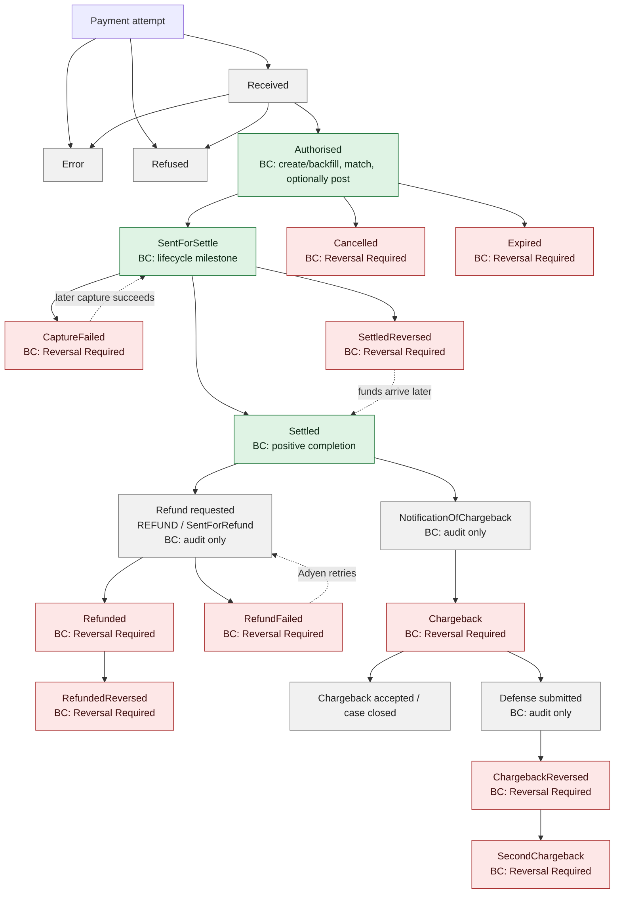

# Adyen payment lifecycle and Business Central behavior

Last verified against the linked Adyen documentation: **2026-09-09**.

This is the canonical functional reference for how the extension relates Adyen's payment lifecycle to Business Central. The two statuses answer different questions:

- **Adyen Lifecycle Status** records the newest supported Adyen outcome for the payment.
- **Status** on Imported Adyen Payment records what Business Central must do: match, post, wait for manual work, investigate a data conflict, or perform finance review.

`Unknown` is the lifecycle default when no supported payment lifecycle has been recorded. It also represents the absence of a payment lifecycle before or after an event.

Event Entries are the authoritative source-and-time audit trail. Imported Adyen Payment is a current projection. Only a chronologically newer supported event can change that projection; duplicate and older events stay in the audit history without regressing it. From any payment list, drill down on the PSP reference or lifecycle status to see all related events, their recorded lifecycle effect, and the linked webhook request or report run. An event's Lifecycle Effect remains `Unknown` until a processing outcome is recorded.

## Lifecycle overview

`Settled` is a final successful payment status, but Adyen can subsequently report a separate financial outcome such as a refund or chargeback. `SettledReversed` can also be corrected by a later `Settled`. A correction updates Adyen Lifecycle Status, but it never automatically clears an existing `Reversal Required` BC status.

## Lifecycle matrix

| Lifecycle phase | PAR record type | Standard webhook event | Classification | BC tracks it? | Resulting Adyen lifecycle | BC action | Possible subsequent outcomes |
| --- | --- | --- | --- | --- | --- | --- | --- |
| Payment received/pending | — | — | Intermediate | No | Unchanged | Audited only if an unsupported event is received | Authorised, Refused, Error |
| Authorisation approved | `Authorised` | `AUTHORISATION` with `success=true` | Intermediate | Yes | `Authorised` | Create or backfill the payment; match; optionally Auto Post | SentForSettle, Cancelled, Expired |
| Authorisation refused/error | — | `AUTHORISATION` with `success=false`, or without a usable success value | Final attempt outcome | Audit only | Unchanged | Intentionally ignored with a disposition reason; do not create a payment | A new payment attempt |
| Capture submitted | `SentForSettle` | `CAPTURE` is retained but not used to project this milestone | Intermediate | Yes, from PAR | `SentForSettle` | Existing payment: lifecycle tracking only. Missing payment: fallback backfill through the normal matching path | Settled, CaptureFailed, SettledReversed |
| Successful settlement | `Settled` | — | Final successful payment outcome | Yes | `Settled` | Record positive completion; backfill a missing payment | Refund or dispute outcomes can follow |
| Authorisation cancelled | `Cancelled` | `CANCELLATION` | Final | Yes | `Cancelled` | `Reversal Required`; no automatic accounting reversal | None for this authorised payment |
| Authorisation expired | `Expired` | `EXPIRE` | Final | Yes | `Expired` | `Reversal Required`; no automatic accounting reversal | None for this authorised payment |
| Capture failed | `CaptureFailed` | `CAPTURE_FAILED` | Consequential, potentially recoverable | Yes | `CaptureFailed` | `Reversal Required`; retain ledger/manual links | Adyen may capture again, then SentForSettle/Settled |
| Refund requested | `SentForRefund` | `REFUND` | Intermediate | PAR: no; webhook: audit only | Unchanged | Skip the PAR row; retain the webhook as intentionally ignored; wait for PAR `Refunded` or a failure/reversal outcome | Refunded, RefundFailed |
| Unreferenced refund authorised | `RefundAuthorised` | — | Intermediate | No | Unchanged | Skip the PAR row | Refunded or cancellation of the unreferenced refund |
| Refund completed | `Refunded` | — | Final refund outcome | Yes | `Refunded` | `Reversal Required`; no automatic refund entry | Normally final; a reversal may be reported separately |
| Refund failed | `RefundFailed` | `REFUND_FAILED` | Consequential, potentially recoverable | Yes | `RefundFailed` | `Reversal Required` | SentForRefund, Refunded |
| Refund reversed | `RefundedReversed` | `REFUNDED_REVERSED` | Final correction | Yes | `RefundedReversed` | `Reversal Required` remains sticky | Manual alternative refund outside this extension |
| Dispute announced | — | `NOTIFICATION_OF_CHARGEBACK` | Intermediate | Audit only | Unchanged | Intentionally ignored; the extension does not manage dispute cases | Chargeback, case withdrawal |
| Chargeback booked | `Chargeback` | `CHARGEBACK` | Financially consequential | Yes | `Chargeback` | `Reversal Required` | Accept/finalize, defend, ChargebackReversed |
| Defense workflow | — | defense-related dispute notifications | Intermediate | Audit only | Unchanged | Intentionally ignored; manage the case in Adyen | ChargebackReversed, case closed |
| Chargeback reversed | `ChargebackReversed` | `CHARGEBACK_REVERSED` | Correction | Yes | `ChargebackReversed` | `Reversal Required` remains sticky | SecondChargeback or case closed |
| Second chargeback | `SecondChargeback` | `SECOND_CHARGEBACK` | Final dispute outcome | Yes | `SecondChargeback` | `Reversal Required` | Case-specific follow-up outside this extension |
| Settlement reversed | `SettledReversed` | `SETTLEMENT_REVERSED` when supplied | Consequential, potentially recoverable | Yes | `SettledReversed` | `Reversal Required` | Later `Settled` if Adyen receives the funds |
| Late settlement recovery | `Settled` | — | Correction | Yes | `Settled` | Update lifecycle only; do not clear `Reversal Required` | Finance closes review manually after reconciliation |

## Business Central action rules

### Create, backfill, match, and optionally post

A successful `AUTHORISATION` webhook and PAR `Authorised` row take the normal payment path. PAR `SentForSettle` and `Settled` are fallback creation points if the earlier authorisation was missed. The payment identity is merchant account plus the original payment PSP reference, so milestones do not create separate payments.

Automatic posting remains authorisation-based. Report backfill uses the merchant's configured Auto Post behavior when creating a missing payment.

### Lifecycle tracking only

For an existing payment with matching shopper, currency, and amount, `SentForSettle` and `Settled` update Adyen Lifecycle Status without changing its matching, posting, journal, or ledger state. A later recovery can update the lifecycle while BC finance review remains sticky.

### Reversal Required

Cancelled, expired, capture-failed, refund, dispute, and settlement-reversal outcomes listed as tracked above set the BC payment to `Reversal Required`. The extension retains posted and manual journal links and never creates a reversing entry automatically. Finance must inspect the chronological Event Entries and follow the approved accounting procedure.

### Data Conflict

If a positive PAR milestone disagrees with the retained payment's shopper reference, currency, or amount, BC sets `Data Conflict` and keeps the original payment data. `Reversal Required` has precedence: a report mismatch never clears or replaces an existing reversal review.

### Audited but intentionally ignored

Unsupported webhook events remain Event Entries with a disposition reason and do not change the payment. This includes `REFUND`, `CANCEL_OR_REFUND`, `TECHNICAL_CANCEL`, capture acknowledgements not used by this projection, and dispute-case workflow notifications. Unsupported PAR rows such as `SentForRefund` and `RefundAuthorised` are intentionally skipped by the relevant-row parser rather than normalized as Event Entries. Waiting for a financially meaningful outcome avoids duplicate or premature BC actions.

## PAR amount source

The parser requires both `Authorised (PC)` and `Captured (PC)` columns. Each row only needs a valid value in the register used by that record type:

- absolute `Authorised (PC)` is used for `Authorised`, `Cancelled`, and `Expired`;
- absolute `Captured (PC)` is used for `SentForSettle`, `Settled`, capture/refund/dispute records, and settlement reversals.

An empty `Captured (PC)` value is therefore accepted for `Authorised`, `Cancelled`, and `Expired` rows. The row identity includes the normalized signed amount from the authoritative column; the stored event amount is its absolute value.

This extension models one full payment amount. A different captured or refunded amount is a data conflict rather than an automatic partial-payment workflow.

## Exclusions

The following need a richer allocation or case model and are outside this extension:

- partial or multiple captures;
- partial or multiple refunds;
- installment settlement/refund flows;
- authorisation adjustments and incremental authorisations;
- externally acquired, externally settled, externally refunded, or otherwise externally handled payments;
- Adyen orders;
- unreferenced point-of-sale refunds;
- payout, settlement-detail, fee, and bank reconciliation;
- full dispute-case workflow, evidence submission, and dispute deadlines.

These events may remain available in Event Entries when Adyen sends them, but they do not alter the Imported Adyen Payment projection unless explicitly listed as tracked in the matrix.

## Adyen references

- [Payments lifecycle](https://docs.adyen.com/account/payments-lifecycle/)
- [Payment Accounting Report](https://docs.adyen.com/reporting/invoice-reconciliation/payment-accounting-report)
- [Webhook structure and types](https://docs.adyen.com/development-resources/webhooks/webhook-types/)
- [Dispute webhooks](https://docs.adyen.com/risk-management/disputes-api/dispute-notifications)
